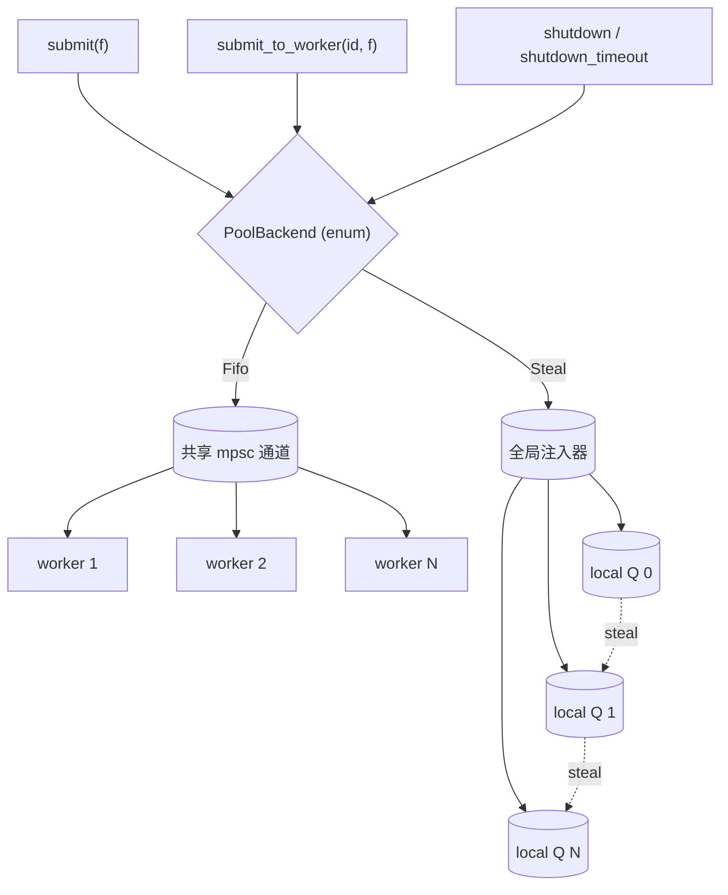

<p align="center">
  
  
  
  
</p>

<h1 align="center">schedulite-rs</h1>

<p align="center">
  <em>Lightweight · Observable · Panic-safe · Zero-dependency</em>
</p>

<p align="center">
  <strong>FIFO & work-stealing dual-mode Rust task scheduler</strong><br>
  bounded queue backpressure · <code>shutdown_timeout</code> · built-in metrics<br>
  <br>
  <a href="#中文">中文</a> ·
  <a href="#quick-start">Quick Start</a> ·
  <a href="#api">API</a> ·
  <a href="#architecture">Architecture</a> ·
  <a href="#benchmark-highlights">Benchmarks</a>
</p>

---

## Quick start

```powershell
cargo test                                    # 24 tests

cargo run --example hash_bench -- 4 1000      # CPU benchmark
cargo run --example skew_bench -- 4 2000 0.9  # FIFO vs Steal
cargo run --example dir_scan -- . 4           # IO+CPU filesystem scan

cargo bench                                   # criterion benchmark
```

## Features

| Feature | Description |
| :-: | :-: |
| Fixed worker pool | Configurable thread count with graceful shutdown |
| Panic isolation | `catch_unwind` per task; workers survive panics |
| Dual-mode scheduling | `SchedulerMode::Fifo` / `SchedulerMode::Steal` |
| Bounded queue | `queue_capacity` with `QueueFull` backpressure |
| `shutdown_timeout` | Bounded wait; detached workers on timeout |
| Built-in metrics | `submitted` / `completed` / `panicked` / `stolen` |
| `PoolBuilder` | Fluent builder with compile-time validation |
| Zero deps | Only `std`; comparison deps are dev-only |

## API

```rust
use std::time::Duration;
use schedulite_rs::{PoolBuilder, SchedulerMode, SchedulitePool};

// Quick FIFO pool
let mut pool = SchedulitePool::new(4);

// Builder with all options
let mut pool = PoolBuilder::new()
    .workers(4)
    .mode(SchedulerMode::Steal)
    .queue_capacity(256)
    .build();

pool.submit(|| println!("hello"))?;
pool.submit_to_worker(0, || println!("skew to worker 0"))?;

pool.shutdown()?;
pool.shutdown_timeout(Duration::from_secs(5))?;

let m = pool.metrics_snapshot();
assert_eq!(m.completed, 2);
```

## Architecture


<details>
<summary>Source tree</summary>

```
schedulite-rs/
├── Cargo.toml
├── README.md
├── src/
│   ├── lib.rs                 # re-exports
│   ├── error.rs               # PoolError
│   ├── config.rs              # SchedulerMode, PoolConfig
│   ├── task/mod.rs            # Job, TaskOutcome, run_job_safely
│   ├── pool/
│   │   ├── mod.rs             # SchedulitePool, PoolBuilder
│   │   └── metrics.rs         # AtomicU64 counters
│   └── scheduler/
│       ├── mod.rs             # PoolBackend (enum)
│       ├── fifo.rs            # mpsc + Message::Terminate
│       └── steal.rs           # VecDeque + injector + steal
├── examples/
│   ├── hash_bench.rs
│   ├── skew_bench.rs
│   └── dir_scan.rs
├── benches/
│   └── pool_vs_spawn.rs
└── tests/
    ├── panic_isolation.rs
    └── fifo_vs_steal.rs
```
</details>

Scheduler dispatch uses an **enum** (not `dyn trait`) for zero-overhead compile-time dispatch.

## Benchmark highlights

Criterion benchmarks compare schedulite-rs against raw `thread::spawn` and the `threadpool` crate.

| Workload | `thread::spawn` | schedulite FIFO | schedulite Steal | threadpool v1.8 |
| :-: | :-: | :-: | :-: | :-: |
| 4w × 100t | 2.54 ms | 148 µs | 138 µs | 158 µs |
| 4w × 1000t | 25.4 ms | 515 µs | 592 µs | 334 µs |
| 8w × 2000t | 150 ms | 926 µs | 2.56 ms | 934 µs |

Thread pools are **50–150× faster** than spawning per-task threads.  
schedulite FIFO is competitive with `threadpool` while offering more features.

<details>
<summary>Run benchmarks yourself</summary>

```powershell
cargo bench
# Results in: target/criterion/report/index.html
```
</details>

## References & comparison

| Reference project | What we learned | How schedulite-rs differs |
| :-: | :-: | :-: |
| [Rust Book ch21](https://doc.rust-lang.org/book/ch21-02-multithreaded.html) | FIFO pool + shutdown protocol | Added Steal mode, panic-safe, bounded queue, metrics |
| [easy_threadpool](https://github.com/NicoElbers/easy_threadpool) | `catch_unwind` panic handling | Added Steal mode, `PoolBuilder`, built-in metrics |
| [work-queue.rs](https://github.com/SabrinaJewson/work-queue.rs) | Work-stealing queue algorithm | Integrated into unified dual-mode API with metrics |
| [rust-threadpool](https://github.com/rust-threadpool/rust-threadpool) | — | Included in benchmark comparison (see above) |

## License

This project is licensed under MIT — free and open.

---

<h1 id="中文" align="center">schedulite-rs</h1>

<p align="center">
  <em>轻量 · 可观测 · panic 安全 · 零依赖</em>
</p>

<p align="center">
  <strong>FIFO 与 work-stealing 双模式 Rust 任务调度器</strong><br>
  有界队列回压 · <code>shutdown_timeout</code> · 内置 metrics<br>
  <br>
  <a href="#schedulite-rs">English</a>
</p>

---

## 快速开始

```powershell
cargo test                                    # 24 个测试

cargo run --example hash_bench -- 4 1000      # CPU 密集 demo
cargo run --example skew_bench -- 4 2000 0.9  # FIFO vs Steal 对比
cargo run --example dir_scan -- . 4           # IO+CPU 混合 demo

cargo bench                                   # criterion 基准测试
```

## 功能特性

| 特性 | 说明 |
| :-: | :-: |
| 固定 worker 池 | 可配置线程数，优雅停机 |
| Panic 隔离 | `catch_unwind` 保护，单任务 panic 不拖垮 worker |
| 双模式调度 | `SchedulerMode::Fifo` / `SchedulerMode::Steal` |
| 有界队列 | `queue_capacity` 配合 `QueueFull` 回压 |
| `shutdown_timeout` | 超时停机，解除 `Drop` 死锁 |
| 内置 metrics | `submitted` / `completed` / `panicked` / `stolen` |
| `PoolBuilder` | 流式构建器 API |
| 零依赖 | 仅 `std`；benchmark 对比用 criterion + threadpool (dev-only) |

## API

```rust
use std::time::Duration;
use schedulite_rs::{PoolBuilder, SchedulerMode, SchedulitePool};

let mut pool = SchedulitePool::new(4);

let mut pool = PoolBuilder::new()
    .workers(4)
    .mode(SchedulerMode::Steal)
    .queue_capacity(256)
    .build();

pool.submit(|| println!("hello"))?;
pool.submit_to_worker(0, || println!("skew to worker 0"))?;

pool.shutdown()?;
pool.shutdown_timeout(Duration::from_secs(5))?;

let m = pool.metrics_snapshot();
```

## 架构



调度器使用 **enum**（非 `dyn trait`），编译期分发，零虚函数开销。

<details>
<summary>源码目录结构</summary>

```
schedulite-rs/
├── Cargo.toml
├── README.md
├── src/
│   ├── lib.rs                 # 对外 re-export
│   ├── error.rs               # PoolError
│   ├── config.rs              # SchedulerMode, PoolConfig
│   ├── task/mod.rs            # Job, TaskOutcome, run_job_safely
│   ├── pool/
│   │   ├── mod.rs             # SchedulitePool, PoolBuilder
│   │   └── metrics.rs         # AtomicU64 计数器
│   └── scheduler/
│       ├── mod.rs             # PoolBackend (enum)
│       ├── fifo.rs            # mpsc + Message::Terminate
│       └── steal.rs           # VecDeque + injector + steal
├── examples/
│   ├── hash_bench.rs
│   ├── skew_bench.rs
│   └── dir_scan.rs
├── benches/
│   └── pool_vs_spawn.rs
└── tests/
    ├── panic_isolation.rs
    └── fifo_vs_steal.rs
```
</details>

## Benchmark

| 工作负载 | `thread::spawn` | schedulite FIFO | schedulite Steal | threadpool v1.8 |
| :-: | :-: | :-: | :-: | :-: |
| 4w × 100t | 2.54 ms | 148 µs | 138 µs | 158 µs |
| 4w × 1000t | 25.4 ms | 515 µs | 592 µs | 334 µs |
| 8w × 2000t | 150 ms | 926 µs | 2.56 ms | 934 µs |

线程池相比裸 `thread::spawn` 快 **50–150 倍**。

## 参考与对比

| 参考项目 | 借鉴内容 | 本项目改进 |
| :-: | :-: | :-: |
| Rust Book ch21 | FIFO 线程池 + shutdown | 增加 Steal 模式、panic-safe、有界队列、metrics |
| easy_threadpool | `catch_unwind` panic 处理 | 增加 Steal 模式、`PoolBuilder`、内置 metrics |
| work-queue.rs | steal 队列算法 | 自研，集成为统一双模式 API 并内置 metrics |
| rust-threadpool | — | benchmark 对比（见上方） |

## License

本项目使用 MIT 协议，开放自由。
